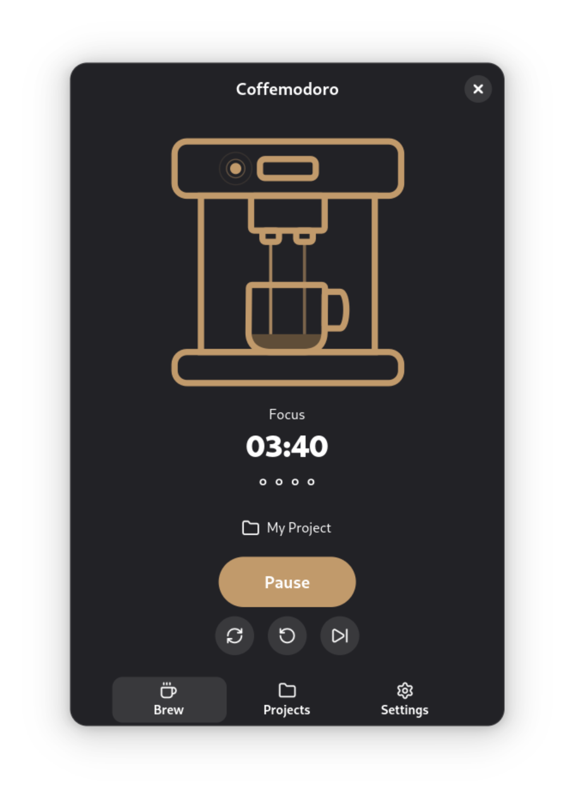
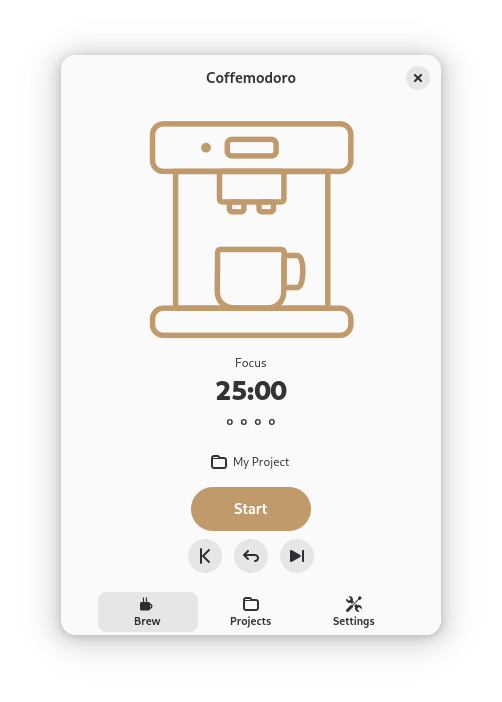

# Coffemodoro

A coffee-themed Pomodoro timer for GNOME.

| Dark mode (Debian) | Light mode (Debian) |
|:----:|:-----:|
|  |  |

## Features

- **Animated timer** — a coffee machine fills up during focus and drains during breaks, driven by timer progress
- **Pomodoro timer** — focus sessions with configurable short and long break cycles
- **Projects** — organise your work by project and assign sessions as you go
- **Session notes** — add a description to each completed session
- **Session history** — browse all sessions per project with dates, durations, and notes
- **Export** — save a project's history as a Markdown summary
- **Backup & restore** — export your entire database to JSON and restore it on any machine
- **Notifications & sound** — desktop notification and configurable audio cue when a session completes
- **Tray icon** — GNOME tray icon to show and hide the window
- **Focus window** — optionally raise the window automatically when a session ends

## Requirements

- GNOME 45 or newer
- Supported distros: Ubuntu 24.04+, Fedora 40+, Arch Linux, Debian 13+, openSUSE Tumbleweed
- Tested on: Ubuntu 24.04, Fedora 43, Debian 13

## Installation

```bash
git clone https://github.com/VLTNXV/Coffemodoro.git
cd Coffemodoro
./install.sh
```

The script detects your package manager (apt/dnf/pacman), installs system dependencies, and sets up the app and its icon in your application launcher.

> [!TIP]
> The tray icon requires the [AppIndicator and KStatusNotifierItem Support](https://extensions.gnome.org/extension/615/appindicator-support/) GNOME Shell extension.

> [!NOTE]
> If `coffemodoro` isn't found after install, add `~/.local/bin` to your PATH:
> ```bash
> echo 'export PATH="$HOME/.local/bin:$PATH"' >> ~/.bashrc && source ~/.bashrc
> ```

## Uninstallation

```bash
./uninstall.sh
```

Removes the app, desktop entry, and icons. Your data (`~/.local/share/coffemodoro/`) is preserved.

---

> [!NOTE]
> This project was built using Claude Code.
> The coffee machine SVG asset was created by [VLTNXV](https://github.com/VLTNXV).
